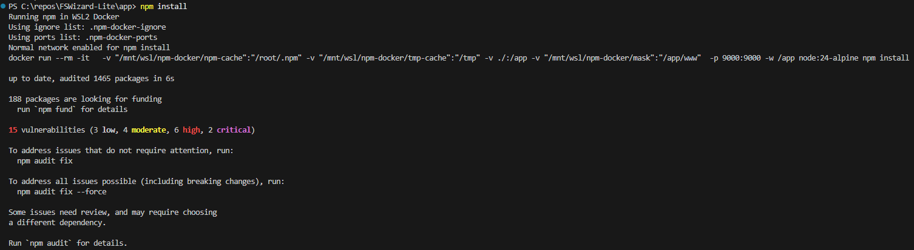

# npm-docker

A Windows/Linux script that runs `npm` commands inside Docker containers.



---

## Features

- Runs ALL npm commands in Docker, no local Node/npm required.
- Automatically detects `.nvmrc` and selects matching Node major version (e.g., `node:18-alpine`).
- Supports hoisted / shared `node_modules` in monorepos.
- Automatically mounts nearest `node_modules` to `/app/node_modules`.
- Supports blocklisted files through `.npm-docker-ignore`.
- Supports port forwarding using `.npm-docker-ports`.
- Pure Docker — Node installations NOT required.

---

## Installation

### Windows

1. Place `npm-docker.cmd` in a directory included in your `PATH`
   (e.g., `C:\npm-docker\`).
2. Optionally rename it to `npm.cmd` to fully replace the host `npm`.
3. Requires Docker installed and running.

### Linux

1. Copy the script to `/usr/local/bin/`:
   ```bash
   sudo cp npm-docker.sh /usr/local/bin/npm-docker
   ```
2. Make it executable:
   ```bash
   sudo chmod +x /usr/local/bin/npm-docker
   ```
3. Optionally create a symlink named `npm` to fully replace the host `npm`:
   ```bash
   sudo ln -sf /usr/local/bin/npm-docker /usr/local/bin/npm
   ```
---

## Monorepo Support (Hoisted node_modules)

If your `node_modules` is located **outside the project folder**,  
the script automatically searches parent directories and mounts the first one it finds into:

```
/app/node_modules
```


No configuration needed — automatic detection.

---

## Node Version Detection via `.nvmrc`

If `.nvmrc` exists, the script reads the **major version only**:

`.nvmrc`:
```
18.16.1
```

Script will automatically use:

```
node:18-alpine
```
No more need to manage node versions.

---

## Port Mapping

Create a `.npm-docker-ports` file in your project root:

```
3000
4200:4200
8080:80
```

---

## Ignoring Files
Do not expose your secrets to the internet.

Create `.npm-docker-ignore` to prevent mounting certain paths:

```
.env
dist
.secret-config
```

The script masks files/dirs using empty placeholders.

---

## Benefits

| Benefit | Description |
|---------|-------------|
| Safety | npm runs sandboxed in Docker |
| Consistency | Same Node version, same OS, same environment across all machines |
| Zero Host Pollution | No local Node, npm, or dependencies required |

---

## Script Execution Configuration

**npm-docker** respects the `ignore-scripts=true` setting in your `.npmrc` file (local or global).

This is **recommended** for security — it prevents automatic execution of npm lifecycle scripts (preinstall, postinstall, etc.) which can be a security risk.

To enable, add to your `.npmrc` file:
```
ignore-scripts=true
```

Or set it globally:
```bash
npm config set ignore-scripts true
```

---
## Known Issues

- Large npm dependency trees can cause "file count" or inode errors in WSL2 when the project resides on a mounted Windows path (e.g. /mnt/c/...).
  - Fix: Move the project to a native Linux path such as /home/user/ inside WSL2.

---

## License

MIT License  
Created by Eldar Gerfanov.  
Use at your own risk.

---

## Tip

This script can fully **replace npm on Windows** — safer, cleaner, and portable.

```
rename npm-docker.cmd to npm.cmd
put it first in PATH
enjoy isolated npm everywhere
```

---

## Want to Improve It?

Pull requests welcome!

---
